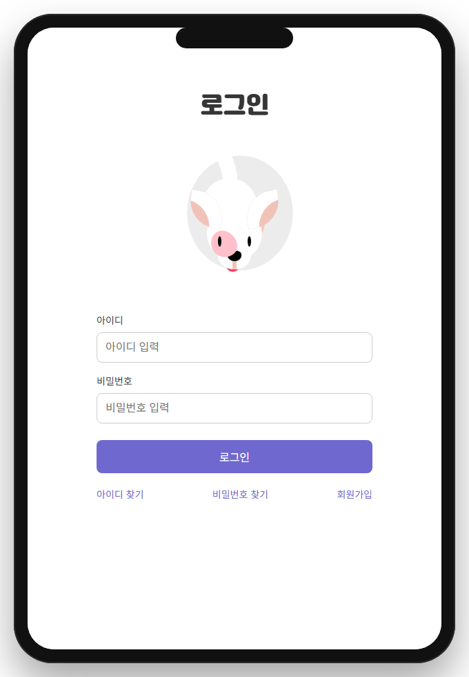
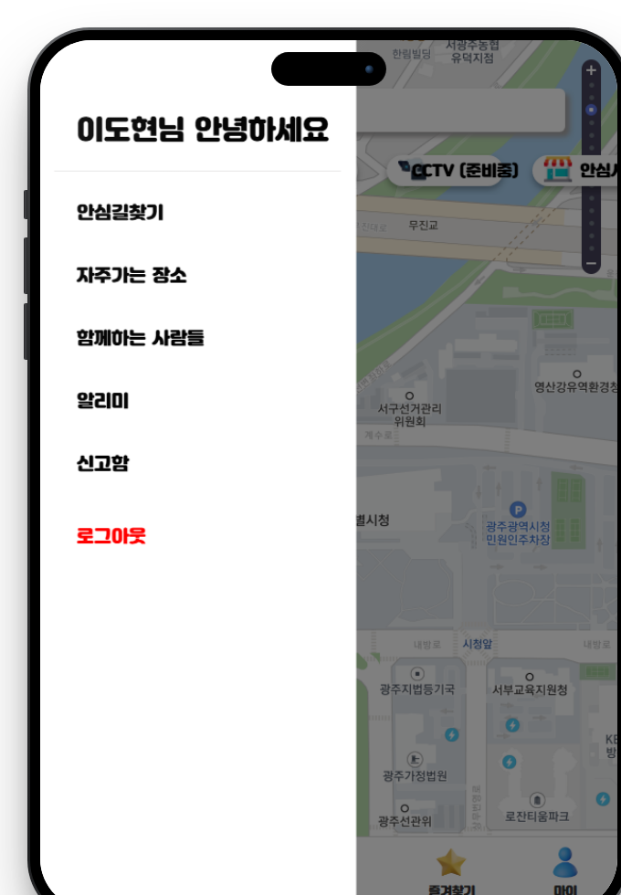
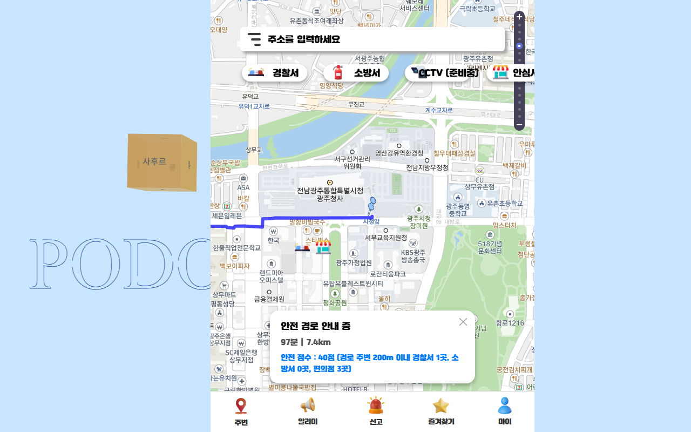
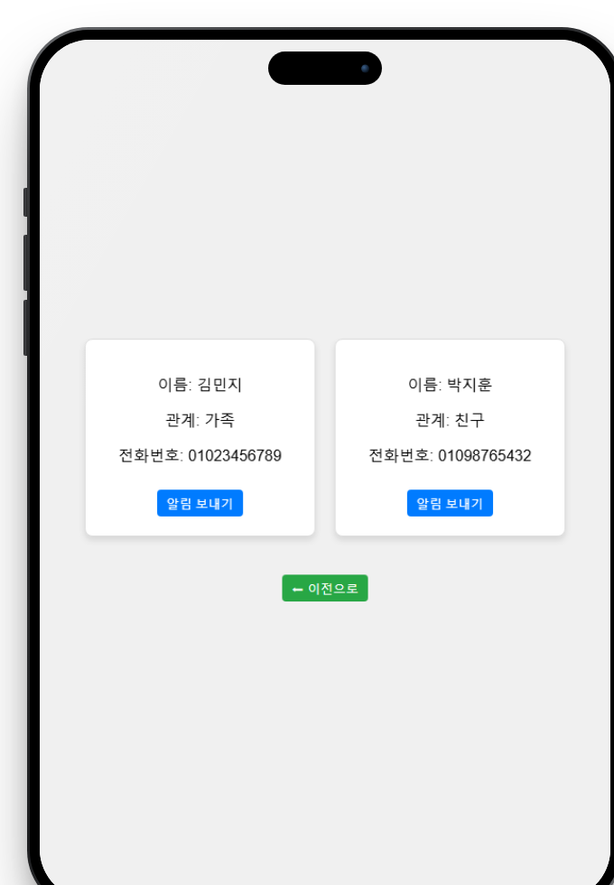

# 포도 (PODO) - 안전 경로 안내 서비스

밤길 귀가가 불안한 노약자, 여성, 아동을 위한 안전 경로 안내 서비스입니다. 최단 경로가 아니라 경찰서, 소방서, 편의점, CCTV 같은 주변 안전시설을 기준으로 점수를 매겨서, 조금 돌아가더라도 안전한 길을 추천해줍니다.

- 기간: 2025.04 ~ 2025.05 (3주)
- 인원: 4인 팀
- 팀 원본 저장소: https://github.com/2025-SMHRD-IS-CLOUD-2/PODO

## 사용 기술

Java, Spring MVC, JSP, MyBatis, MySQL, T-Map API, jQuery

## 담당한 부분

로그인, 메인 지도와 사이드바, 경로탐색, 보호자 등록까지 총 4개 화면을 맡았습니다.

로그인 화면은 폼 UI와 아이디·비밀번호 찾기, 회원가입 페이지 이동 기능을 구현했습니다. 메인 화면은 T-Map API를 활용하여 지도를 구현하고, 경찰서·소방서·CCTV·편의점 마커를 카테고리별로 토글하여 노출 여부를 제어할 수 있도록 구성했습니다. 경로탐색 화면은 출발지와 목적지를 입력하면 추천 경로를 표시하는 레이아웃을 구현했으며, 보호자 화면은 등록된 보호자 정보를 수정하거나 삭제할 수 있도록 구현했습니다.

## 트러블슈팅

처음 겪었던 문제는 변수명 불일치였습니다. 백엔드에서 내려주는 값이 프론트에서 계속 undefined로 출력돼서 처음에는 제 코드가 잘못된 줄 알고 한참 찾아봤는데, 확인해보니 애초에 백엔드와 프론트에서 쓰는 변수명 자체가 서로 달랐습니다. 팀원에게 문의해서 이름을 맞추고 나서야 해결됐고, 이후로는 작업을 시작하기 전에 변수명부터 먼저 맞추는 습관이 생겼습니다.

두 번째는 경로탐색 화면에서 출발지 좌표가 도착 페이지까지 정상적으로 전달되지 않는 문제였습니다. 처음에는 AJAX로 좌표를 받아 바로 다음 화면에서 사용하면 될 거라고 생각했는데, 페이지가 이동하는 순간 그 값이 사라져버렸습니다. 콘솔에 계속 null만 출력돼서 한참 헤맸는데, 개발자도구 네트워크 탭으로 요청을 하나씩 확인하면서 원인을 찾을 수 있었습니다. 결국 좌표를 AJAX로 들고 있는 대신 페이지 이동 시 URL 파라미터에 함께 실어서 넘기는 방식으로 변경했고, 그 이후로는 다음 페이지에서도 좌표를 정상적으로 받을 수 있었습니다.

포트폴리오용으로 다시 정리하면서 안전경로 기능도 실제로 동작하게 만들어보려 했는데, 여기서도 예상 못한 문제를 만났습니다. T-Map API에는 안전도를 반영해서 길을 찾아주는 옵션이 따로 없어서, 경로 주변 실제 경찰서를 경유지로 지정해 다시 길찾기를 요청하는 방식으로 구현해봤습니다. 경유지가 실제로 반영되는 것까지는 확인했는데, 여러 구간으로 테스트해보니 경찰서가 큰길에서 벗어난 골목에 있을 때는 최단경로로 가다가 그 골목만 의미 없이 왕복하고 나오는 부자연스러운 경로가 나왔습니다. 이건 안전한 길이 아니라 그냥 최단경로에 경유지 하나를 억지로 끼워넣은 것뿐이라고 판단해서, 경로 자체를 바꾸는 대신 실제 안전시설 위치 데이터로 점수를 계산하고 지도에 마커로 보여주는 방식으로 되돌렸습니다. 기술적으로 구현이 된다고 바로 쓰는 것보다, 실제로 여러 경우에 돌려보고 결과가 말이 되는지 확인하는 과정이 필요하다는 걸 느꼈습니다.

## 느낀 점

팀 프로젝트를 진행하면서 느꼈던 건, 막힐 때 코드만 계속 들여다본다고 해서 답이 나오는 건 아니라는 점이었습니다. 변수명 문제는 팀원에게 짧게 질문해서 5분 만에 해결됐는데, 그 전까지는 혼자 몇 시간을 붙잡고 있었습니다. 그 경험 이후로 30분 이상 막히면 일단 질문부터 해보자는 나름의 기준이 생겼습니다.

## 실행 방법

### 사전 준비물

아래 4가지가 미리 설치되어 있어야 합니다.

- JDK 17
- Maven
- Tomcat 9
- MySQL

### 순서

1. 저장소를 clone 받습니다.

   ```
   git clone https://github.com/DoHyeonL/PODO.git
   ```

2. MySQL에 데이터베이스를 생성하고, 저장소에 포함된 `schema.sql`을 실행해 테이블을 만듭니다.

   ```
   CREATE DATABASE podo;
   ```

   ```
   mysql -u [계정명] -p podo < schema.sql
   ```

   (원본 DDL 파일이 팀 저장소에 남아있지 않아서, Mapper XML의 쿼리를 보고 역으로 구성한 스키마입니다. 실제 컬럼 구성과 다를 수 있습니다.)

3. `src/main/java/com/cloud/db/mybatis-config.xml`을 열어서 DB 접속 정보(url, username, password)를 본인 환경에 맞게 수정합니다.

4. 프로젝트 폴더에서 Maven으로 빌드합니다.

   ```
   mvn package
   ```

   `target` 폴더 안에 `deepsick-0.0.1-SNAPSHOT.war` 파일이 생성됩니다.

5. 생성된 war 파일을 Tomcat의 `webapps` 폴더에 넣고 Tomcat을 실행합니다.

6. 브라우저에서 아래 주소로 접속합니다.

   ```
   http://localhost:8080/deepsick-0.0.1-SNAPSHOT/login.jsp
   ```

   (war 파일 이름을 다른 이름으로 바꿔서 배포하면, 그 이름이 주소에 들어갑니다. 예: `deepsick.war`로 이름을 바꿨다면 `/deepsick/login.jsp`)

## 화면 구성

### 로그인


### 메인 + 사이드바


### 경로탐색


### 보호자 등록

